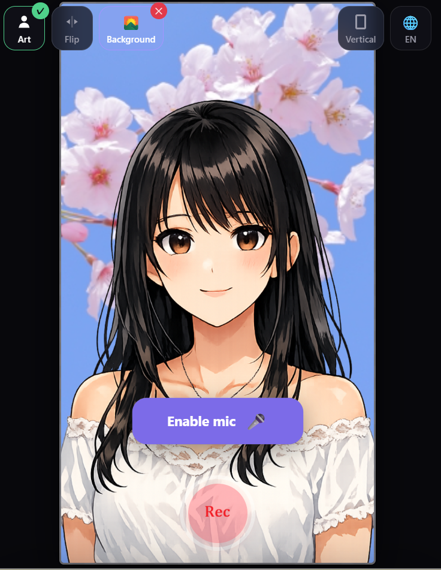

# 🌸 Recdoor Lite

**HTML 1枚のVTuberレコーダー。ブラウザだけで動く。**

A single-HTML VTuber recorder that runs entirely in your browser.

<p align="left">
  
</p>

<p align="left">
  <a href="https://ayamestudio.github.io/recdoor-lite/mobile.html">📱 Mobile Demo</a>
  &nbsp;|&nbsp;
  <a href="https://ayamestudio.github.io/recdoor-lite/desktop.html">💻 Desktop Demo</a>
</p>

---

## Why Recdoor Lite

**Zero install.** Open a URL, and it works. No app store, no download, no waiting. People drop off at install screens — Recdoor Lite doesn't have one.

**Privacy.** Your images and voice never leave your device. Nothing is uploaded, nothing is tracked, nothing is stored on any server. Ever.

**One HTML file.** Recording, lip-sync, blinking, 4 languages, iOS support — zero libraries, one file. Fork it, host it, send it to a friend.

**VTuber in 3 minutes.** Generate character art with ChatGPT, open Recdoor Lite, hit record. Made for TikTok, Reels, and Shorts.

---

## Sample Images

3 sample images are included — try them right away.

<p align="left">
  
  
  
</p>

---

## Quick Start

1. **Create your character** — Use ChatGPT, Midjourney, or any tool to generate a PNG character image.
2. **Open Recdoor Lite** — Visit the URL on your phone (or PC). Load your character, allow the mic.
3. **Record & save** — Hit the red button, talk, save the video.

---

## Features

### Mobile Version (`mobile.html`)
- Vertical (9:16) recording, optimized for short-form video
- 1 image → breathing animation
- 2 images → lip-sync (open/close mouth)
- 3 images → lip-sync + blinking
- Voice-reactive bar animation on the mic
- Touch & pinch to move/resize character
- iOS: MP4 (H.264/AAC) · Android: WebM — auto-detected
- Countdown: 2, 1 → record
- Screen Wake Lock to prevent sleep during recording
- 4 languages: English, 日本語, 中文, Español

### Desktop Version (`desktop.html`)
- Full-featured PC version
- Horizontal & vertical layout options
- Keyboard shortcuts
- Additional customization options

---

## Browser Support

| Platform | Browser | Minimum |
|----------|---------|---------|
| iPhone / iPad | Safari | iOS 15+ |
| Android | Chrome | Android 10+ |
| PC / Mac | Chrome, Edge, Firefox | Latest |

> **HTTPS is required** for microphone access and MediaRecorder. Hosting on GitHub Pages provides this automatically.

---

## Hosting (GitHub Pages)

This repository is ready for GitHub Pages:

1. Push all files to a GitHub repository
2. Go to **Settings → Pages**
3. Set source to **Deploy from a branch** → `main` / `/ (root)`
4. Your site will be live at `https://yourusername.github.io/recdoor-lite/`

The mobile app will be accessible at:
```
https://yourusername.github.io/recdoor-lite/mobile.html
```

---

## File Structure

```
recdoor-lite/
├── mobile.html     ← Mobile VTuber recorder
├── desktop.html    ← Desktop VTuber recorder
├── README.md       ← This file
└── LICENSE         ← MIT License
```

---

## For Developers

### Local Development

Serve the files over HTTPS locally (required for mic/recording):

```bash
# Python (quick)
python3 -m http.server 8000
# Then open http://localhost:8000/mobile.html

# For HTTPS (required on mobile devices):
# Use ngrok, Caddy, or mkcert + a local HTTPS server
```

### Modding

Each HTML file is fully self-contained — no build step, no dependencies, no framework. Open it in any text editor and start changing things. Key areas:

- **Colors**: CSS custom properties at the top (`:root { ... }`)
- **Languages**: The `T` object in `<script>` contains all translatable strings
- **Animation**: Canvas rendering loop in the `drawFrame()` function
- **Recording**: `MediaRecorder` setup in the recording section

---

## License

**MIT License** — see [LICENSE](./LICENSE) for the full legal text.

### ライセンス（かんたん要約・非公式）
このソフトウェアは無料で使えます。改変・再配布・商用利用すべてOK。著作権表示とライセンス文を残してください。正式な条文は LICENSE ファイルを参照してください。

### License (plain summary, unofficial)
This software is free to use, modify, redistribute, and use commercially. Just keep the copyright notice and license text. See the LICENSE file for the official terms.

### 许可证（简单说明，非正式）
本软件免费使用。可以修改、再发布、商用。请保留版权声明和许可证文本。正式条款请参阅 LICENSE 文件。

### Licencia (resumen simple, no oficial)
Este software es gratuito. Puedes modificarlo, redistribuirlo y usarlo comercialmente. Solo conserva el aviso de copyright y el texto de la licencia. Consulta el archivo LICENSE para los términos oficiales.

---

<p align="center">Made with <a href="https://recdoor.com/">Recdoor</a>🌸 — 2026</p>
